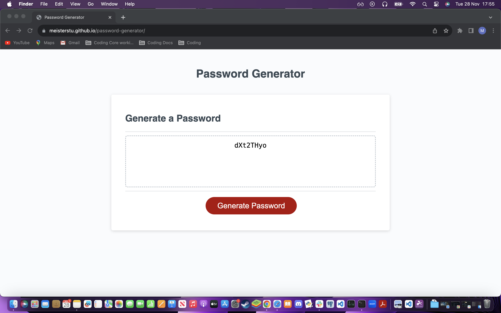

# password-generator

## Description

Instructions were to use Javascript to create a functioning password generator.

## Installation

N/A.

## Usage

https://meisterstu.github.io/password-generator/

## Credits

Assistance was received from the tutor Jose Lopez with refracting the code and tying the separate functions together.

## License

Please refer to the LICENSE in the rep.
